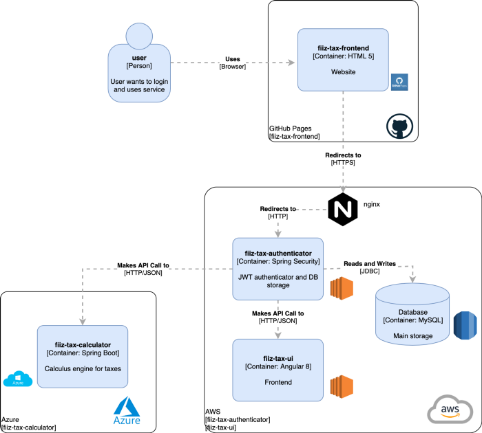

# Authenticator and STS service for the FIIZ TAX backend




This app is up and running [here](https://fiiztax.com).

## Features
- JWT Authentication
- Orchestrator service

## Technologies
- Spring Boot 2.2.2
- Swagger 2

## Build
```
mvn clean install
```

## Run
```
java -jar fiiz-tax-authenticator-0.0.1-SNAPSHOT.jar
```
## Usage

This service will run in the port 8081 by default.
To access the swagger interface, go to:
```
http://localhost:8081/swagger-ui.html
```

## License
This project is licensed under the
MIT License - see the [LICENSE](LICENSE) file for details.
